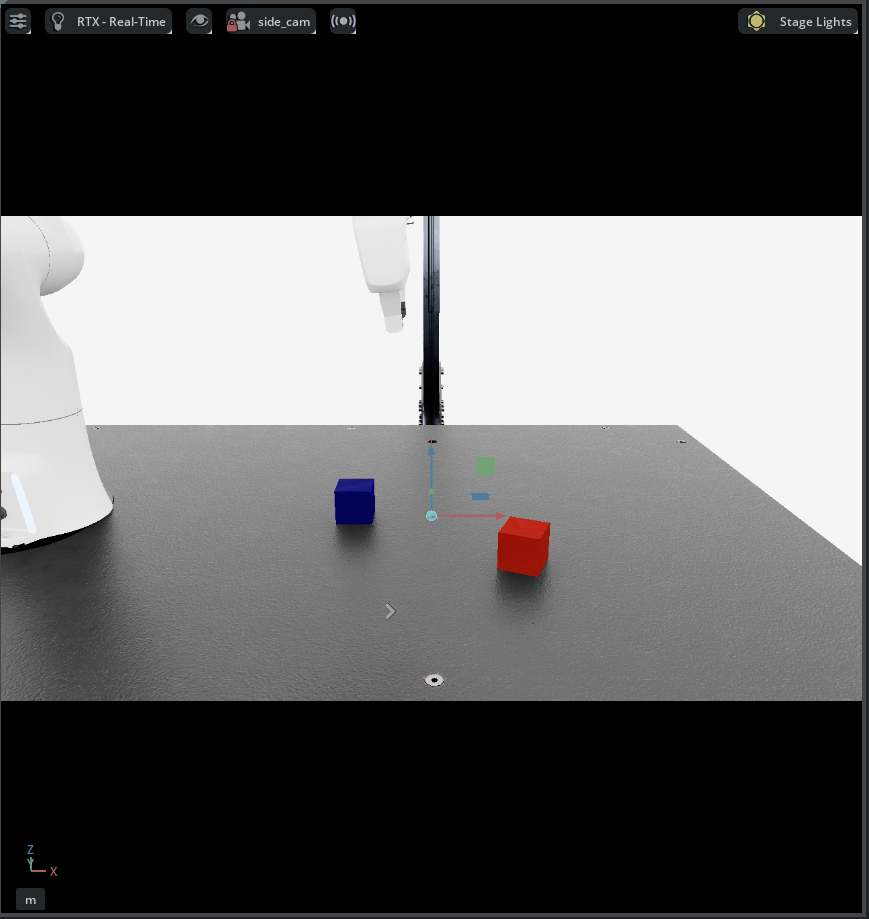
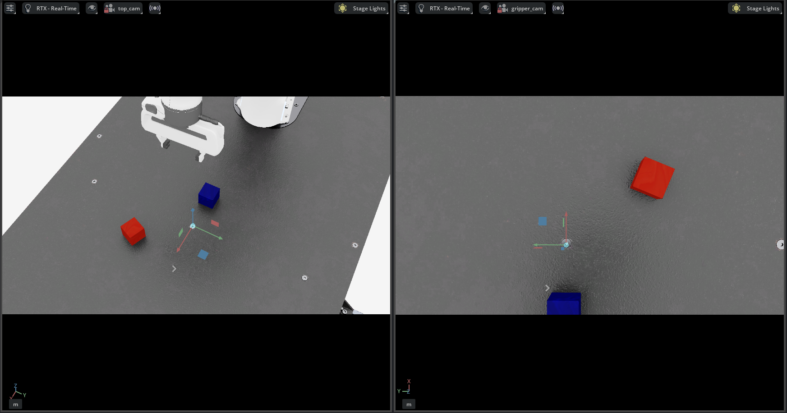

# Franka ACT Pick-and-Place in Isaac Lab

This project builds a two-cube pick-and-place task in Isaac Lab and trains an ACT (Action Chunking with Transformers) policy with LeRobot. The Franka Panda must pick up the **red cube** and place it **beside the blue cube**.

```text
Custom two-cube task → keyboard demonstrations → HDF5 → LeRobot
→ ACT training → closed-loop inference → randomized evaluation
```

## 1. Setup

### Prerequisites

- Ubuntu with an NVIDIA GPU and a compatible driver
- [Isaac Sim and Isaac Lab](https://isaac-sim.github.io/IsaacLab/main/source/setup/installation/index.html)
- [LeRobot](https://huggingface.co/docs/lerobot/installation)

Keep Isaac Lab and this project in separate sibling directories:

```bash
mkdir -p franka-workspace
cd franka-workspace
git clone --branch release/2.3.0 https://github.com/isaac-sim/IsaacLab.git
git clone https://github.com/minxxeo/franka-act-pick-place-isaac-lab.git
export ISAACLAB_PATH="$(pwd)/IsaacLab"
export PROJECT_PATH="$(pwd)/franka-act-pick-place-isaac-lab"
```

| Conda environment | Purpose |
|---|---|
| `isaacsim` | Isaac Sim/Lab, teleoperation, recording, evaluation |
| `lerobot` | Dataset conversion, ACT training, policy server |

The names `env_isaacsim` and `env_lerobot` below are examples. Replace them with the names used on your machine.

```bash
conda activate env_isaacsim
cd "$ISAACLAB_PATH"
./isaaclab.sh --help

conda activate env_lerobot
cd "$PROJECT_PATH"
python -c "import lerobot; print(lerobot.__version__)"
```

Copy the custom task configuration into Isaac Lab:

```bash
cp "$PROJECT_PATH/source/isaaclab_tasks/isaaclab_tasks/manager_based/manipulation/stack/config/franka/pick_place_cube_ik_rel_visuomotor_env_cfg.py" \
  "$ISAACLAB_PATH/source/isaaclab_tasks/isaaclab_tasks/manager_based/manipulation/stack/config/franka/"
cp "$PROJECT_PATH/source/isaaclab_tasks/isaaclab_tasks/manager_based/manipulation/stack/config/franka/__init__.py" \
  "$ISAACLAB_PATH/source/isaaclab_tasks/isaaclab_tasks/manager_based/manipulation/stack/config/franka/__init__.py"
```

### Project variables

Set the reusable values once after entering the repository. `ACT_SERVER_PORT` may be changed to any unused local TCP port; the server and client must use the same value.

```bash
export TASK_ID="Isaac-PickPlace-Cube-Franka-IK-Rel-Visuomotor-Random-v0"
export ACT_TASK_ID="Isaac-PickPlace-Cube-Franka-ACT-JointPos-Random-v0"
export RUN_NAME="pick_place_40"
export HDF5_DATASET="$ISAACLAB_PATH/datasets/${RUN_NAME}.hdf5"
export LEROBOT_DATASET="$PROJECT_PATH/datasets/lerobot/${RUN_NAME}"
export LEROBOT_REPO_ID="local/isaac_${RUN_NAME}"
export ACT_RUN_NAME="act_${RUN_NAME}_chunk10_50k"
export POLICY_DIR="$PROJECT_PATH/outputs/${ACT_RUN_NAME}/checkpoints/050000/pretrained_model"
export ACT_SERVER_PORT="${ACT_SERVER_PORT:-5555}"
```

## 2. Custom Two-Cube Environment

The stock three-cube stacking task was adapted into a two-cube task. The green cube was removed, `cube_1` is the blue reference cube, and `cube_2` is the movable red cube. The complete scene, camera, task, randomization, and action configuration is self-contained in one environment file. All paths below are relative to the cloned repository root (`$ISAACLAB_PATH`).

```text
source/isaaclab_tasks/isaaclab_tasks/manager_based/manipulation/stack/config/franka/
├── pick_place_cube_ik_rel_visuomotor_env_cfg.py
└── __init__.py
```

`pick_place_cube_ik_rel_visuomotor_env_cfg.py` directly extends Isaac Lab's `FrankaCubeStackVisuomotorEnvCfg`; no intermediate custom two-cube configuration file is required.

### Remove the third cube

The self-contained pick-and-place configuration extends `FrankaCubeStackVisuomotorEnvCfg` directly and removes every term that assumes a third cube exists:

```python
@configclass
class FrankaPickPlaceCubeFixedEnvCfg(FrankaCubeStackVisuomotorEnvCfg):
    observations: ThreeCameraObservationsCfg = ThreeCameraObservationsCfg()

    def __post_init__(self):
        super().__post_init__()
        self.scene.cube_3 = None
        self.observations.policy.object = None
        self.observations.policy.cube_positions = None
        self.observations.policy.cube_orientations = None
        self.observations.subtask_terms.grasp_2 = None
        self.terminations.cube_3_dropping = None
```

### Pick-and-place success condition

An episode succeeds when the released red cube is stable on the table and its XY center is 0.055–0.12 m from the blue cube:

```python
beside_blue = (center_distance > 0.055) & (center_distance < 0.12)
on_table = height_error < 0.015
stable = linear_speed < 0.10
success = beside_blue & on_table & stable & gripper_open
```

### Reset randomization

The blue cube is restored to `(0.40, 0.00, 0.0203)` at every reset. The red cube pose is sampled from:

```python
pose_range = {
    "x": (0.52, 0.66),
    "y": (-0.20, 0.20),
    "z": (0.0203, 0.0203),
    "yaw": (-3.14159, 3.14159),
}
```

### Camera observations

| Observation | Resolution | Purpose |
|---|---:|---|
| `gripper_cam` | 84 × 84 RGB | Grasp and release close-up |
| `side_cam` | 84 × 84 RGB | Grasp and placement height |
| `top_cam` | 84 × 84 RGB | Cubes and workspace geometry |



*Side camera (`side_cam`)*



*Top camera (`top_cam`, left) and gripper camera (`gripper_cam`, right)*

All three cameras are declared in `pick_place_cube_ik_rel_visuomotor_env_cfg.py`. Example:

```python
self.scene.side_cam = CameraCfg(
    prim_path="{ENV_REGEX_NS}/side_cam",
    height=84,
    width=84,
    data_types=["rgb"],
    offset=CameraCfg.OffsetCfg(
        pos=(0.5, -0.8, 0.35),
        rot=(-0.58319, 0.81234, 0.0, 0.0),
        convention="ros",
    ),
)
```

### Gym registration and control interfaces

Register both variants in `config/franka/__init__.py`:

```python
gym.register(
    id="Isaac-PickPlace-Cube-Franka-IK-Rel-Visuomotor-Random-v0",
    entry_point="isaaclab.envs:ManagerBasedRLEnv",
    kwargs={"env_cfg_entry_point":
        pick_place_cube_ik_rel_visuomotor_env_cfg.FrankaPickPlaceCubeRandomEnvCfg},
    disable_env_checker=True,
)

gym.register(
    id="Isaac-PickPlace-Cube-Franka-ACT-JointPos-Random-v0",
    entry_point="isaaclab.envs:ManagerBasedRLEnv",
    kwargs={"env_cfg_entry_point":
        pick_place_cube_ik_rel_visuomotor_env_cfg.FrankaPickPlaceCubeActJointPosRandomEnvCfg},
    disable_env_checker=True,
)
```

| Stage | Gym ID | Action |
|---|---|---|
| Demonstration | `Isaac-PickPlace-Cube-Franka-IK-Rel-Visuomotor-Random-v0` | 6D relative end-effector delta + gripper |
| ACT evaluation | `Isaac-PickPlace-Cube-Franka-ACT-JointPos-Random-v0` | 7D absolute arm joints + gripper |

Relative IK is intuitive for keyboard teleoperation. The converted ACT data uses absolute joint targets, so the evaluation environment accepts an 8D absolute joint-position action. The scene, observations, randomization, and objective remain unchanged.

## 3. Test Teleoperation

```bash
conda activate env_isaacsim
cd "$ISAACLAB_PATH"

./isaaclab.sh -p scripts/environments/teleoperation/teleop_se3_agent.py \
  --task "$TASK_ID" \
  --teleop_device keyboard \
  --enable_cameras
```

| Motion | Key |
|---|---|
| X / Y / Z | `W/S`, `A/D`, `Q/E` |
| Roll / Pitch / Yaw | `Z/X`, `T/G`, `C/V` |
| Gripper | `K` |
| Reset | `R` |

## 4. Record 40 Demonstrations

Record 40 successful demonstrations at 20 Hz:

```bash
conda activate env_isaacsim
cd "$ISAACLAB_PATH"

./isaaclab.sh -p scripts/tools/record_demos.py \
  --task "$TASK_ID" \
  --teleop_device keyboard \
  --dataset_file "$HDF5_DATASET" \
  --step_hz 20 \
  --num_demos 40 \
  --num_success_steps 10 \
  --enable_cameras
```

A demonstration is saved after success remains true for 10 consecutive steps. Avoid long pauses and unnecessary corrections because idle or oscillatory commands can become training targets.

Replay before conversion:

```bash
./isaaclab.sh -p scripts/tools/replay_demos.py \
  --dataset_file "$HDF5_DATASET" \
  --enable_cameras
```

## 5. Convert HDF5 to LeRobot

| Feature | Shape |
|---|---:|
| `observation.state` | 9: 7 arm + 2 finger joints |
| `action` | 8: next 7 arm joint positions + gripper command |
| Three RGB observations | 84 × 84 × 3 each |

```bash
conda activate env_lerobot
cd "$PROJECT_PATH"

python scripts/convert_pick_place_hdf5_to_lerobot.py \
  --inputs "$HDF5_DATASET" \
  --output "$LEROBOT_DATASET" \
  --repo-id "$LEROBOT_REPO_ID" \
  --fps 20 \
  --pre-motion-frames 5 \
  --overwrite
```

Five pre-motion frames preserve 0.25 seconds of initial context while removing a long pause before the first arm motion.

## 6. Train ACT

| Parameter | Value |
|---|---:|
| Dataset | 40 demonstrations |
| Training steps | 50,000 |
| Batch size | 8 |
| Save interval | 10,000 steps |
| Chunk sizes | 10 / 30 / 50 / 100 |
| Image augmentation | Disabled |

At 20 Hz, chunks 10, 30, 50, and 100 span 0.5, 1.5, 2.5, and 5.0 seconds.

```bash
conda activate env_lerobot
cd "$PROJECT_PATH"

lerobot-train \
  --dataset.repo_id="$LEROBOT_REPO_ID" \
  --dataset.root="$LEROBOT_DATASET" \
  --policy.type=act \
  --policy.device=cuda \
  --policy.push_to_hub=false \
  --policy.chunk_size=10 \
  --policy.n_action_steps=10 \
  --output_dir="$PROJECT_PATH/outputs/$ACT_RUN_NAME" \
  --job_name="$ACT_RUN_NAME" \
  --steps=50000 \
  --batch_size=8 \
  --num_workers=4 \
  --save_checkpoint=true \
  --save_freq=10000 \
  --wandb.enable=false
```

Run the 10/30/50 sweep by repeating the command with the desired chunk size. If using the included helper script, first verify that its dataset and output paths match the local repository:

```bash
bash scripts/tools/train_act_chunk_sweep.sh
```

For chunk 100, use the same command with both chunk fields set to `100` and a separate output directory.

```bash
tail -n 30 -F \
  outputs/act_pick_place_chunk10_50k.log \
  outputs/act_pick_place_chunk30_50k.log \
  outputs/act_pick_place_chunk50_50k.log \
  outputs/act_pick_place_chunk100_50k.log
```

## 7. Run Closed-Loop Inference

Use two terminals because LeRobot and Isaac Lab run in separate Conda environments.

### Terminal 1: ACT policy server

Temporal ensemble OFF, executing 10 queued actions per prediction:

```bash
conda activate env_lerobot
cd "$PROJECT_PATH"

python -u scripts/act_policy_server.py \
  --checkpoint "$POLICY_DIR" \
  --device cuda \
  --n_action_steps 10 \
  --port "$ACT_SERVER_PORT"
```

Temporal ensemble ON:

```bash
python -u scripts/act_policy_server.py \
  --checkpoint "$POLICY_DIR" \
  --device cuda \
  --temporal_ensemble_coeff 0.01 \
  --port "$ACT_SERVER_PORT"
```

With temporal ensembling enabled, the server sets `n_action_steps=1`, predicts a chunk at every timestep, and averages overlapping predictions for the same execution time.

If the port is occupied:

```bash
lsof -nP -iTCP:"$ACT_SERVER_PORT" -sTCP:LISTEN
kill <PID>
```

### Terminal 2: Isaac Lab GUI client

```bash
conda activate env_isaacsim
cd "$ISAACLAB_PATH"

./isaaclab.sh -p "$PROJECT_PATH/scripts/eval_act_pick_place.py" \
  --task "$ACT_TASK_ID" \
  --num_episodes 1 \
  --max_steps 500 \
  --replan_interval 0 \
  --server_port "$ACT_SERVER_PORT" \
  --no_save_results \
  --enable_cameras
```

## 8. Evaluate Policies

Use the randomized environment and the same seed range for a fair 30-episode comparison. Add `--headless` for unattended evaluation.

```bash
./isaaclab.sh -p "$PROJECT_PATH/scripts/eval_act_pick_place.py" \
  --task "$ACT_TASK_ID" \
  --num_episodes 30 \
  --max_steps 500 \
  --replan_interval 0 \
  --seed 52000 \
  --server_port "$ACT_SERVER_PORT" \
  --results outputs/act_pick_place_eval/example.csv \
  --headless \
  --enable_cameras
```

Each CSV stores the task, episode, success flag, step count, termination reason, replan interval, and seed. Temporal ensembling is an inference option—not a separate training run—and can change both smoothness and success because it changes the executed trajectory.

## Repository Files

The following files are sufficient to publish the custom environment documentation and implementation:

```text
franka-act-pick-place-isaac-lab/
├── README.md
├── docs/images/
│   ├── camera_views.png
│   └── side_cam.png
├── scripts/
│   ├── act_policy_server.py
│   ├── convert_pick_place_hdf5_to_lerobot.py
│   └── eval_act_pick_place.py
└── source/isaaclab_tasks/isaaclab_tasks/manager_based/manipulation/stack/config/franka/
    ├── __init__.py
    └── pick_place_cube_ik_rel_visuomotor_env_cfg.py
```

The commands in this guide additionally use these helper scripts when they are included in the repository:

```text
scripts/tools/
├── act_policy_server.py
├── convert_pick_place_hdf5_to_lerobot.py
├── eval_act_pick_place.py
└── train_act_chunk_sweep.sh
```

The following directories are generated locally and should normally be excluded from Git:

```text
datasets/    # recorded HDF5 files and converted LeRobot datasets
outputs/     # checkpoints, logs, CSV files, and evaluation outputs
```

## References

- [Isaac Lab](https://github.com/isaac-sim/IsaacLab)
- [LeRobot ACT](https://huggingface.co/docs/lerobot/act)
